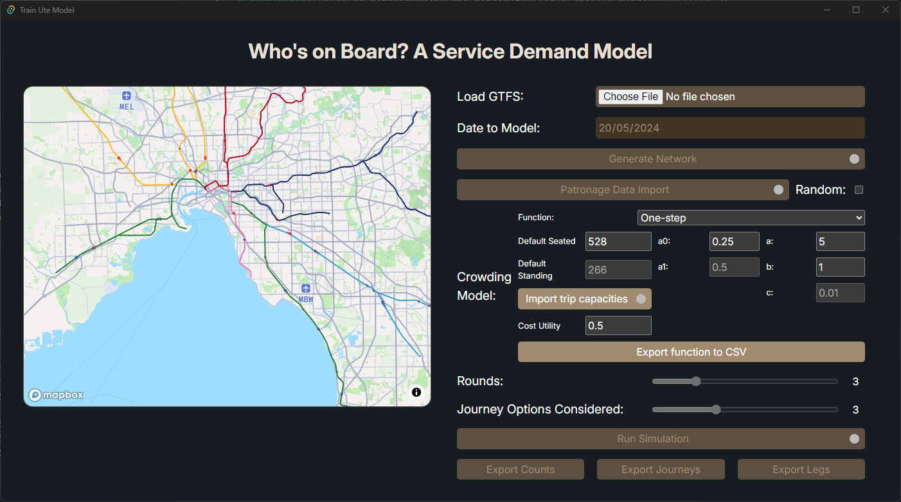

# The "Who's on Board?" Rail Service Demand Model

This is the main repository for the "Who's on Board?" (WoB) model, a method of assigning passenger trips from origin-destination trip data derived from smart card systems.
This software was created for a Bachelor of Science Advanced: Global Challenges honours project.

The design decisions have been informed by using this model for Melbourne's metropolitan train network, but in principle the model should be generally applicable given sufficient data.



## Building

WoB uses Rust for the backend, and Svelte for the frontend (enabled by the Tauri framework). To set up the project, you will need Rust and Node.js/whatever you like that can read package.json files.
The Raptor submodule is a self-contained crate that contains the pathfinding logic, so you'll need to clone with submodules:
```bash
git clone -recurse-submodules https://github.com/ArupHonsGC24/whos_on_board.git
```

From there, you'll need to install the latest version of the Tauri CLI tool:
```bash
cargo install tauri-cli --locked
```

Then from the project directory run
```bash
cargo tauri build
```
to build WoB as a bundled executable.

## Binaries

If you don't want to build WoB yourself, you can download a pre-built binary 
from the [releases page](https://github.com/ArupHonsGC24/whos_on_board/releases/latest).

## Data inputs

The model takes various data inputs:
- A static GTFS feed (such as from [DataVIC](https://discover.data.vic.gov.au/dataset/timetable-and-geographic-information-gtfs)).
- Patronage data, as a list of trips to make on the network.
- Optionally, some per-trip train capacities to allow varying rollingstock across the network.

## Patronage data:

Currently, the patronage data needs to be in a specific format. Due to its size it's read in as a parquet, and contains the following columns:

| Origin_Station (String) | Destination_Station (String) | Departure_Time (Time64Microsecond) | Agent Count (Int64) |
|-------------------------|------------------------------|------------------------------------|---------------------|
| ...                     | ...                          | ...                                | ...                 |
| Glenbervie              | Melbourne Central            | 08:15:00                           | 4                   |
| Ferntree Gully          | Southern Cross               | 08:15:00                           | 3                   |
| ...                     | ...                          | ...                                | ...                 |

There is also a option to use randomised patronage data (a generated list of randomly selected pairs of points across the network), which lets you get a feel for how the model works.
